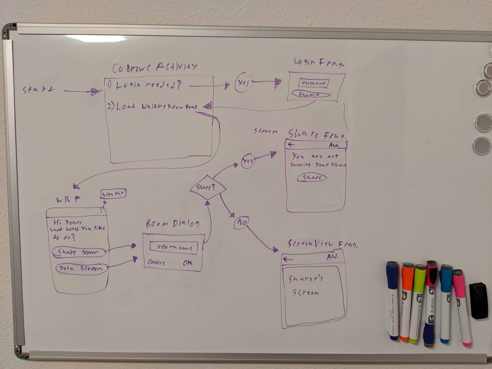

# Setup

### Design Process
After reading the requirements I drew out a user flow on a white board to get a better understanding of how to build the app. 

I decided to create four very simple screens instead of having one screen that does everything, in order to follow a single responsibility design. Seperating out the screens into fragments worked out nicely in that the view logic was concise and directly related to the task at hand. Shortly after getting familiar with the Twilio SDK I relized that much of the logic would be reused in both sharing and viewing a screen, along with relaying audio and touch events. Becuase of this, I abstracted the SDK logic into it's own class and injected it into the fragments with Koin. This was great as it gave me code reuse and seperation of concerns, which will make testing easier. 

### Known Issues

### Access Tokens
To ensure the  access tokens are retrieved correctly, make sure to use ngrok to setup a public http endpoint as specified  [in these instructions](https://github.com/twilio/video-quickstart-android#setup-an-access-token-server) . Once the server is setup, place the access token server URL in the local.properties file.

> TWILIO_ACCESS_TOKEN_SERVER=\<server  URL\>

Similar to how to setup token retrieval configuration for the    [quickstartKotlin](https://github.com/twilio/video-quickstart-android/tree/master/quickstartKotlin) example project.

### Build
Simply open this project in AndroidStudio and run the app module run configuration to deploy the apk on two Android devices. There are no special build types or flavors, just select the debug build type.